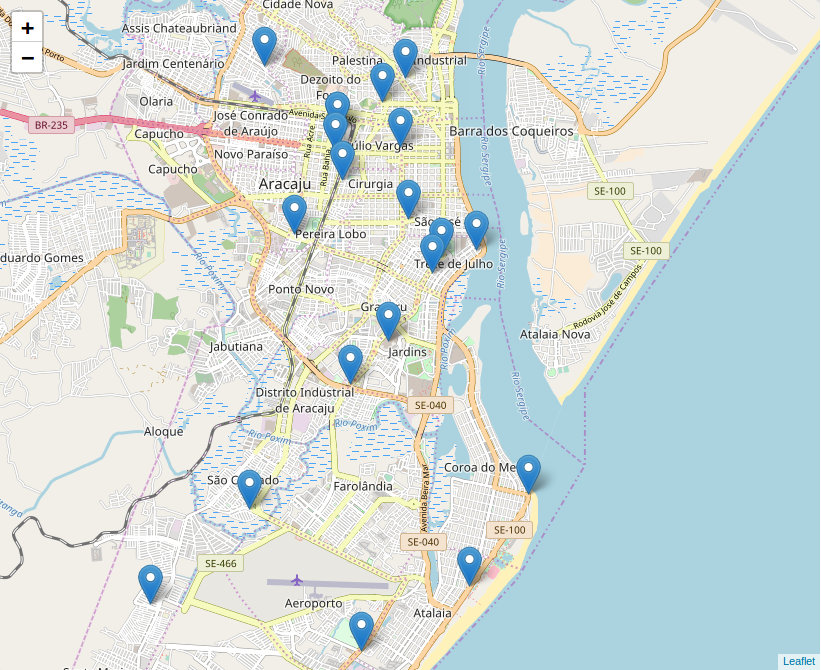
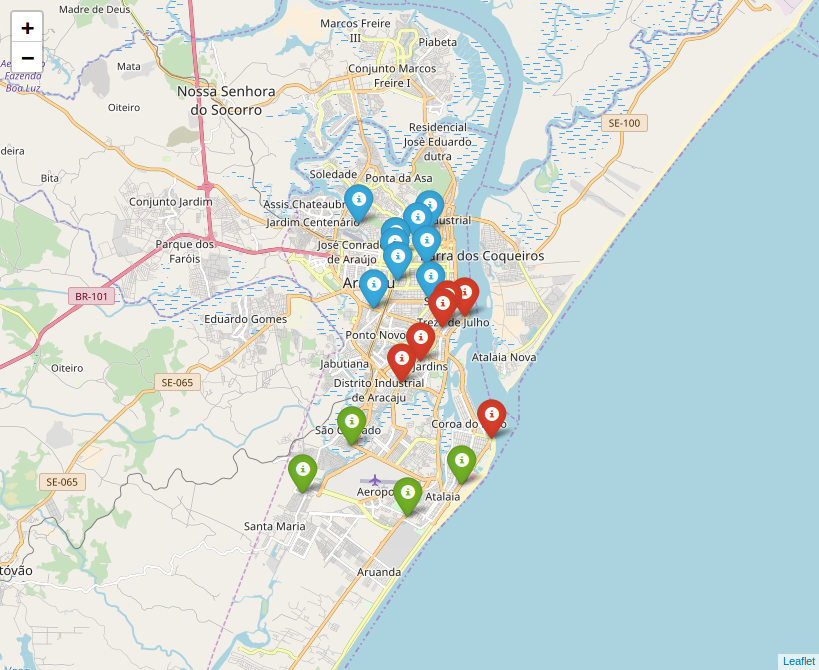
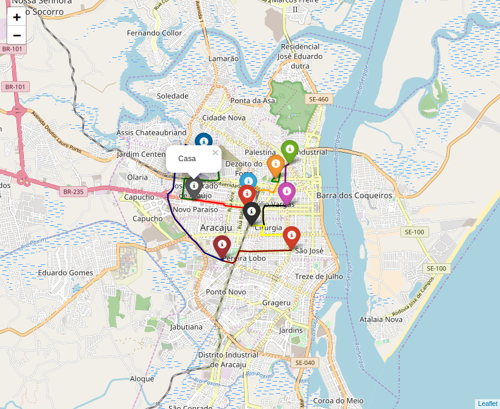
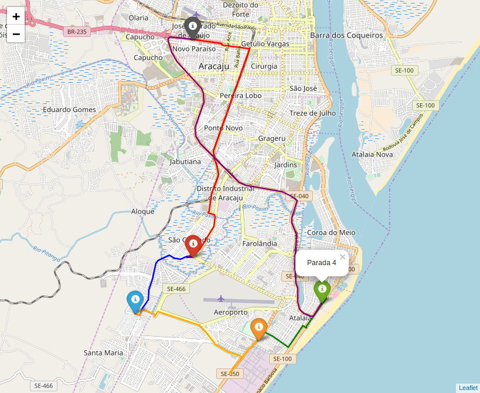
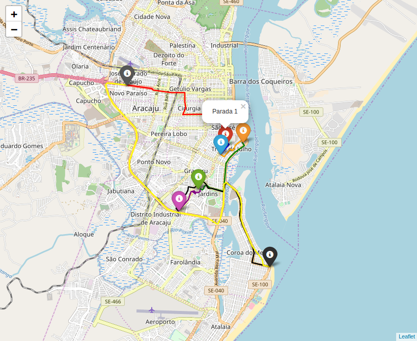

# Best Route

Best rout é um projeto pessoal que estou desenvolvendo que refere-se a obter a melhor rota, podendo ser aplicado em empresas de transporte de mercadorias, empresas de turismo, ou até mesmo a pessoas que não conheçam em detalhes uma certa cidade e que queira visitar alguns pontos turísticos (restaurantes, bares, etc) com o menor percurso.

Esse projeto surgiu da necessidade que tive quando precisei visitar três lugares diferentes sem preferência de ordem e não sabia qual seria o melhor trajeto. Aposto que você já teve esse tipo de problema ou conhece alguém que já passou por isso.

A priore o algoritmo que otimiza a trajetória considera que o ponto de partida é o mesmo que o ponto de chegada, de modo que é obtido o melhor percurso com relação aos locais que serão visitados, mas no futuro quero deixar essa opção livre para o usuário escolher.

----

Abaixo apresento um exemplo referente a alguns bares localizado na cidade de Aracaju - Se. Aqui estou usando a biblioteca folium para plotar os mapas, enquanto os endereços destes bares foi obtido pelo site guiamais.

----

Primeiramente vejamos no mapa a localização dos bares escolhidos. Note que os mesmos estão um pouco espalhados pela cidade.

----

Vamos supor que tenhamos 3 dias disponiveis para visitar todos esses bares (rsrs). Deste modo vou separar esses bares em 3 grupos.

----

## Obtendo a melhor rota para cada grupo

Com os grupos bem definidos, podemos usar o algoritmo de otimização e obter a melhor trajetória. Estas trajetórias obtidas é refente a trajetória utilizando um veiculo (aqui é só um exemplo, por favor se beber não dirija).

#### Grupo de bares referente aos icones azuis

#### Grupo de bares referente aos icones verdes

#### Grupo de bares referente aos icones vermelhos

## Considerações finais

Best route pode ser algo que venha a facilitar a vida das pessoas e até de empresas que queriam otimizar a entrega dos seus produtos. O projeto está bem no inicio, mas o problema de otimização está bem encaminhado. Os próximos passos pretendo aumentar o grau de dificuldade no algoritmo considerando outros fatores.

Caso você tenha gostado da ideia do projeto e queira contribuir de alguma forma, peço que entre em contato comigo. Quem sabe não juntamos forças e algo muito bom surja desta parceria.
